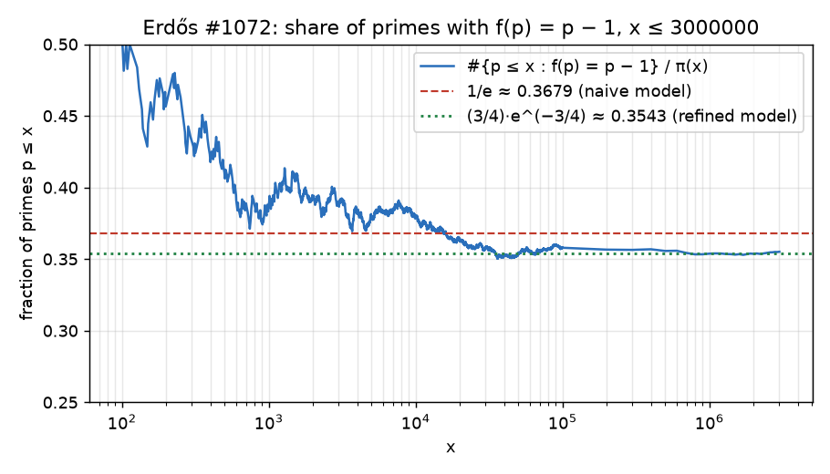

# Erdős Problem #1072: Primes p where p-1 is the least m with p | m!+1

Source: <https://www.erdosproblems.com/1072>

## The problem in plain words

Take a prime p and look at the numbers 1! + 1, 2! + 1, 3! + 1, … . Let f(p) be the first m for which p divides m! + 1. Wilson's theorem says p always divides (p − 1)! + 1, so f(p) is at most p − 1. The problem asks two things:

1. Are there infinitely many primes for which nothing earlier works, that is f(p) = p − 1?
2. For almost all primes, is f(p) a vanishing fraction of p (f(p)/p → 0)?

Example: for p = 11, 5! + 1 = 121 = 11 · 11, so f(11) = 5. For p = 13 none of 1! + 1, …, 11! + 1 is divisible by 13, so f(13) = 12 = p − 1.

## What is already known

- **Known.** The problem is open. It is attributed to Erdős, Hardy and Subbarao, who believed that the number of primes p ≤ x with f(p) = p − 1 is o(x / log x), i.e. a vanishing share of all primes. Sources listed there: Hardy–Subbarao (2002) and Guy's *Unsolved Problems*, problem A2. ([problem page](https://www.erdosproblems.com/1072))
- **Known.** OEIS [A073944](https://oeis.org/A073944) gives f(p) for the first 10,000 primes (b-file by J. E. Schoenfield, first 2,000 terms by T. D. Noe). [A154554](https://oeis.org/A154554) lists the primes with f(p) = p − 1; its b-file has 1,000 terms, the last one 25,349 (T. D. Noe). [A115092](https://oeis.org/A115092) counts the m with p | m! + 1; its example notes that for p = 71 the solutions m = 7, 9, 19, 51, 61, 63, 70 pair up to sum 70.
- We did not read the Hardy–Subbarao paper or Guy's book, so we cite nothing from them directly.

## Why a computer can help

No finite computation can answer either question. What a computer can do is measure how the share of primes with f(p) = p − 1 behaves as x grows, and what the distribution of f(p)/p looks like. If the share were sliding toward zero, that would support the Erdős–Hardy–Subbarao belief; if it sits at a steady constant, that supports the opposite guess. A slow drift like 1/log log x would be invisible at any reachable x, so the data can be suggestive only.

A naive model says: each of the p − 2 numbers 1!, …, (p − 2)! is a random residue mod p, so each hits −1 with chance 1/p, and the chance that none does is about (1 − 1/p)^p ≈ 1/e ≈ 0.368. The same model says the share of primes with f(p)/p < ε is about 1 − e^(−ε), which does *not* go to 0, so the model predicts "no" to both parts of question 2 and "yes, a positive share" to question 1.

## Our results

**How we computed.** Two programs compute f(p) for every prime p in a range, in blocks of 100,000, and write a summary per block (number of primes, how many have f(p) = p − 1, how many have f(p)/p below 13 thresholds ε, and a SHA-256 fingerprint of the list of f values). The two programs use different algorithms:

- `explore.py` walks only the first half, j = 1, …, (p − 1)/2, and uses the identity k! · (p − 1 − k)! ≡ (−1)^(k+1) (mod p) (a consequence of Wilson's theorem). By it, m! ≡ −1 exactly when k! ≡ (−1)^k with k = p − 1 − m, so every hit in the upper half shows up as a condition on a lower-half value. Multiplication mod p uses a floating-point estimate of the quotient with one correction step.
- `verify.py` walks m = 1, 2, …, p − 2 directly, multiplying with the exact integer remainder, and stops at the first m! ≡ −1. It uses no identity at all beyond Wilson's theorem for the final fallback f(p) = p − 1. Its prime sieve and its summary code (exact integer comparisons instead of floating-point ratios) are written separately.

Both are tested against all 10,000 values of A073944 and all 1,000 terms of the A154554 b-file; `verify.py` also reproduces the first 2,000 terms of A115092.

**Budget.** The machine was shared, so every run used a single thread and stayed under 15 minutes. `explore.py` reached 3·10⁶ (about 279 seconds of computing in total), `verify.py` reached 2·10⁶ (about 263 seconds). The planned 10⁷ was not attempted.

**Results.**

- **Verified** (primes p ≤ 2·10⁶, both programs; `results/explore_blocks.csv`, `results/verify_blocks.csv`): the two programs give identical block summaries and identical fingerprints of the f values for every block. In particular, the number of primes p ≤ x with f(p) = p − 1 is:

  | x | π(x) | #{p ≤ x : f(p) = p − 1} | share |
  |---:|---:|---:|---:|
  | 10³ | 168 | 65 | 0.3869 |
  | 10⁴ | 1,229 | 467 | 0.3800 |
  | 10⁵ | 9,592 | 3,433 | 0.3579 |
  | 10⁶ | 78,498 | 27,771 | 0.3538 |
  | 2·10⁶ | 148,933 | 52,674 | 0.3537 |

- **Observed** (explore.py only, p ≤ 3·10⁶; `results/explore_counts.csv`): 76,995 of the 216,816 primes up to 3·10⁶ have f(p) = p − 1, a share of 0.3551. Among the primes in (10⁶, 3·10⁶] alone the share is 0.3559. The share has been flat at 0.353–0.356 from 10⁵ to 3·10⁶ (see the figure). The rows for 10³ and 10⁴ in the verified table are read from the per-prime file `results/explore_f_values.csv`; they are covered by the verified claim because the matching fingerprints (first 16 hex digits of SHA-256) show that both programs produce the same list of f values for all p ≤ 10⁵.
- **Observed** (p ≤ 3·10⁶; `results/explore_distribution.csv`): the share of primes with f(p)/p < ε does not shrink as p grows. For primes in (10⁶, 3·10⁶]: ε = 0.01 → 0.0105, ε = 0.1 → 0.0952, ε = 0.4 → 0.3276, ε = 0.5 → 0.5427, ε = 0.9 → 0.6259. For ε < 0.5 these match 1 − e^(−ε) closely (0.0100, 0.0952, 0.3297). There is a jump of about 0.215 between ε = 0.4 and ε = 0.5 that the naive model does not predict.
- **Observed** (primes 5 ≤ p ≤ 10⁶; `results/explore_mod4.csv`): the jump comes from f(p) = (p − 1)/2 exactly. This happens for 30.2 % of primes p ≡ 3 (mod 4) and never for p ≡ 1 (mod 4). Primes p ≡ 1 (mod 4) have f(p) = p − 1 with share 0.4707, primes p ≡ 3 (mod 4) with share 0.2373.
- **Conjectured** (a refined heuristic, our own, fitted to nothing). The naive model ignores two exact facts. (a) At m = h = (p − 1)/2, Wilson's theorem gives (h!)² ≡ (−1)^(h+1): for p ≡ 1 (mod 4), h! is a square root of −1, so never −1; for p ≡ 3 (mod 4), h! ≡ ±1, which the data shows to be −1 about half of the time. (b) An upper-half hit m = p − 1 − k needs k! ≡ (−1)^k; for odd k that says k! ≡ −1, which would already be a lower-half hit. So, given no hit in the lower half, only the even k (half of them) can still give a hit. Treating everything else as random gives
  - chance of no hit in the lower half: e^(−1/2), times 3/4 for the m = h effect (averaged over p mod 4),
  - chance of no hit in the upper half after that: e^(−1/4),
  - hence a share of **(3/4) · e^(−3/4) ≈ 0.3543** for f(p) = p − 1 (e^(−3/4) ≈ 0.472 for p ≡ 1 mod 4, half that for p ≡ 3 mod 4), and a full prediction for the distribution of f(p)/p (`refined_model` in `explore.py`).

  The data match this closely: 0.3538 at 10⁶ and 0.3551 at 3·10⁶ for the overall share; 0.4707 vs 0.4724 and 0.2373 vs 0.2362 by class; and for ε ≥ 0.5 the predicted shares 0.5451, 0.5673, 0.5884, 0.6085, 0.6276 against observed 0.5427, 0.5646, 0.5862, 0.6062, 0.6259 in (10⁶, 3·10⁶].

**What this suggests, and what it does not.** Up to 3·10⁶ the share of primes with f(p) = p − 1 shows no sign of decreasing; it sits close to the constant 0.354 from the refined model rather than the naive 1/e ≈ 0.368 (the naive value is slightly too high because of the two effects above). Likewise, the share with f(p)/p < ε stays near 1 − e^(−ε), not near 1. Taken at face value, the data favour a positive proportion of primes with f(p) = p − 1 (which would give "infinitely many") and a "no" to f(p)/p → 0 for almost all p, against the belief reported on the problem page. But this is weak evidence: x ≤ 3·10⁶ is tiny, the model is a heuristic, and a decay as slow as 1/log log x cannot be seen at this scale. None of this is a proof of anything.

**Reproduce.** With `NUMBA_NUM_THREADS=1`:
`uv run python problems/1072-factorial-wilson-primes/explore.py --limit 3000000 --threads 1` and
`uv run python problems/1072-factorial-wilson-primes/verify.py --limit 2000000 --threads 1`.
Both save progress after each block in `checkpoints/` and resume if rerun; `--max-minutes` stops a run cleanly. `verify.py --compare` compares the two block files.

## Attempts log

- 2026-09-28: Planned 10⁷ with 4 threads (estimated about 13 minutes for `explore.py`). The budget was cut to one thread and 15-minute runs before any long run started, so the range was lowered to 3·10⁶ (explore) and 2·10⁶ (verify).
- 2026-09-28: A first version of the prime sieve in `verify.py` crashed with an access violation under the installed numba; a restructured loop works and is cross-checked against the numpy sieve in `explore.py` by the tests. Numba's on-disk cache was turned off because cached functions could not be reloaded when the scripts are imported under a different module name by the tests.
- 2026-09-28: The jump in the f(p)/p distribution at 1/2 led to the p mod 4 split and the refined heuristic above; it was noticed in the data, not planned.
